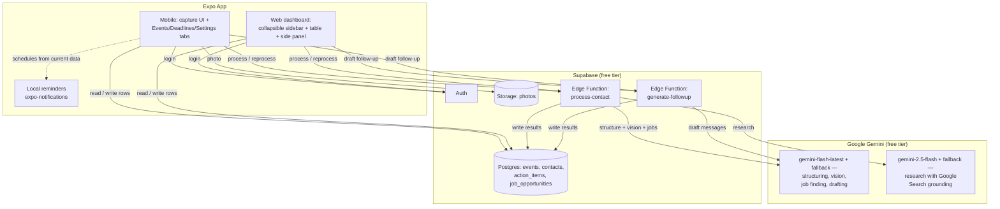

# BoothBuddy

A career fair / networking follow-up assistant. Capture typed notes and a
photo after each conversation in about a minute, and let AI turn it into a
structured contact card, research the person and company, find relevant open
roles, and draft personalized LinkedIn and email follow-ups — all reviewed
in a desktop dashboard at night.

**Live demo:** https://snehmistry.github.io/boothbuddy/ (requires a
Supabase account to sign in — see [Setup](#setup) to run your own)

**Android:** sideloadable APK via [EAS Build](https://docs.expo.dev/build/introduction/)
(free tier) — run `eas build --platform android --profile preview` after
[Setup](#setup) to produce your own installable build.

> Status: all eight build phases are implemented and deployed — capture, the
> Gemini AI pipeline (structuring, vision, research, job finding, drafting),
> the End-of-Day recap, the web dashboard, and a second polish pass (bottom
> tabs, reminders, CSV export, a WCAG AA-checked design system). See
> [Roadmap](#roadmap).

## The problem

At career fairs and networking events you talk to a lot of people quickly.
Afterward it's hard to remember who said what, who to follow up with first,
and what to actually say. BoothBuddy makes capture fast (typed notes + photo,
one-handed, no audio — dictate with your keyboard's mic if you'd rather
speak) and pushes the writing work — structuring the conversation, researching
the person and company, finding open roles, and drafting follow-up
messages — onto AI, done later that night when you have time to review.

## Screenshots

_Coming soon — add screenshots of the capture flow, the AI-structured
contact card, and the web dashboard here before sharing this README
further._

## Features

- [x] Create an "Event" (career fair / networking event) and group contacts under it
- [x] Capture a contact in ~60 seconds: typed notes + photo(s) + company URL/QR + name
- [x] Timeline view of everyone met at an event, with search/filter by name, company, or interest level
- [x] AI-structured contact card: title, company, email, LinkedIn, summary, topics, opportunities mentioned, deadlines, action items, interest level
- [x] Business card / badge / booth photo reading (vision) to fill in missing fields
- [x] Person & company research with source links, a confidence level, and a match confirm/reject step
- [x] Open jobs/internships found per company, with links and deadlines
- [x] "Reprocess with AI" after editing notes or adding photos, with friendly busy/error messages and automatic retry/fallback if Gemini is overloaded
- [x] End-of-Day recap per event: AI-drafted LinkedIn connection note + longer follow-up message, with tone options, character counters, Copy, Regenerate, "Open LinkedIn" (new tab on web), and "Open in Gmail" (pre-filled compose)
- [x] Optional follow-up email draft when an email address is known
- [x] Track follow-up status: Not sent / Sent / Replied
- [x] Jobs-to-apply checklist per event, sorted by deadline, with Applied checkboxes
- [x] Action items checklist per event
- [x] Delete a contact or an entire event (with confirmation), cascading to their photos, action items, and job records
- [x] Change password and a System/Light/Dark appearance preference, from either phone or web
- [x] Editable LinkedIn profile URL per contact (used by "Open LinkedIn" instead of falling back to a name search)
- [x] Export an event's contacts to CSV — downloads on web, native share sheet on phone
- [x] Local reminders (phone only): the day before and morning of each AI-found deadline, plus an 8pm "you met N people, do your follow-ups" nudge on event day
- [x] Phone bottom tabs: Events, a cross-event Deadlines view (every open job, soonest due first), and Settings
- [x] Web dashboard: collapsible sidebar (becomes an off-canvas drawer below 768px) + at-a-glance stats + contacts table + side-by-side contact/draft review, for doing follow-ups at night
- [x] A real design system — light/dark mode with a WCAG AA-checked color system (`npm run check-contrast`), one typography scale, consistent cards/badges/chips/checkboxes, loading skeletons, empty states, hover states on web, and haptic feedback on key phone actions
- [x] Free deployment: web on GitHub Pages, backend on Supabase's free tier, AI on Gemini's free tier, Android via EAS Build's free tier — $0 to run

## How it works

1. **Capture, at the booth.** Open an event, type or dictate a few notes
   about the person, snap a photo of their badge/business card/booth, and
   scan or type their company's URL. Save takes ~60 seconds and doesn't
   block on AI.
2. **Process, in the background.** Saving a contact kicks off the
   `process-contact` Edge Function without waiting for it: Gemini reads any
   photos (vision), structures the notes into a contact card, researches
   the person and company (with a confirm/reject step if the match is
   uncertain), and looks for open roles at their company.
3. **Review, that night.** Open the event's End-of-Day recap or the web
   dashboard to see everyone captured that day: confirm research matches,
   adjust interest level, and check the AI-found jobs and action items.
4. **Draft and send follow-ups.** For each contact, Gemini drafts a LinkedIn
   connection note, a longer follow-up message, and (if an email is known)
   an email — regenerate in a different tone, copy, or open directly in
   LinkedIn / Gmail. Mark each one Sent as you go.
5. **Track what's left.** The jobs-to-apply and action-item checklists
   persist across sessions, so nothing found by AI gets lost between the
   fair and actually applying.

## Tech stack

| Layer            | Choice                                              |
| ---------------- | ---------------------------------------------------- |
| App              | [Expo](https://expo.dev) (React Native) + [Expo Router](https://docs.expo.dev/router/introduction/) + TypeScript — one codebase for iOS, Android, and web, with `.web.tsx` overrides for the desktop dashboard |
| Backend          | [Supabase](https://supabase.com) free tier — Postgres database, email auth, file storage (images) |
| Server-side AI   | Supabase Edge Functions (Deno) — the app never talks to the AI API directly, so the key never lives on-device |
| AI               | Google Gemini API free tier (`gemini-flash-latest`, falling back to `gemini-3.5-flash-lite` under heavy load) — contact structuring, business card/photo reading, job finding, and follow-up drafting; `gemini-2.5-flash`/`gemini-2.5-flash-lite` for person & company research with real Google Search grounding (the only free-tier models with that allowance), all in one provider to keep the project at $0 |
| Capture          | `expo-camera` (photo + QR scanning), `expo-image-picker` |
| Icons            | `@expo/vector-icons` (Ionicons), imported per-family to keep the web bundle small |
| Web hosting      | [GitHub Pages](https://pages.github.com) — free, static hosting for the exported web build |
| Android          | [EAS Build](https://docs.expo.dev/build/introduction/) free tier — sideloadable APK, no Play Store submission needed |
| Notifications    | `expo-notifications` — local-only scheduled reminders, re-derived from current data each time the app opens (no push server) |
| Testing          | Jest (`jest-expo` preset) — unit tests for pure helper functions |

### Why this stack

- **Expo + Expo Router** gives one TypeScript codebase for iOS, Android, and
  web, with platform-specific files (e.g. `Component.web.tsx`) where the
  mobile (capture-focused) and web (review-focused) UIs genuinely differ —
  the web dashboard's sidebar/table/side-panel layout is a completely
  separate root layout from mobile's full-screen stack, but they share every
  data model, hook, and the AI-drafting UI component.
- **Supabase** bundles Postgres + auth + file storage behind one client
  library, which is enough for this app's needs without standing up a
  separate backend server.
- **Edge Functions as an AI proxy** is the only safe way to call an AI API
  from a mobile app: any key bundled into the app binary can be extracted, so
  all AI calls happen server-side, authenticated by the user's Supabase
  session and scoped by Postgres Row Level Security.
- **Gemini free tier only** keeps the whole project at $0 to run — no paid
  APIs, no paid hosting tier. The tradeoff is low rate limits, handled with
  retry-with-backoff and one-contact-at-a-time processing in the Edge
  Functions, and Google Search grounding isn't guaranteed to be available —
  when it isn't, research falls back to the model's own knowledge and the
  UI labels it as not live-searched rather than silently guessing. (Google's
  own docs have shifted toward a newer, explicitly-billed "Interactions API"
  for grounding on their latest models; whether the free `generateContent` +
  `googleSearch` tool path this app uses is still fully supported on
  `gemini-2.5-flash` is genuinely unclear from current documentation, and
  it isn't something worth guessing at or testing by risking the $0 budget —
  so the honest fallback stays rather than a blind migration to a billed API.)
- **GitHub Pages** is free static hosting with no server to maintain; the
  export is a client-side-routed single-page app, so deployment adds one
  `experiments.baseUrl` config value and a `404.html` copy of `index.html`
  (the standard trick for direct navigation to a nested route on a static
  host).

## Architecture



## Project structure

```
src/
  app/           # Expo Router screens (file-based routing) — .web.tsx overrides give the web dashboard its own screens
  app/(tabs)/    # Phone's bottom tab bar (Events/Deadlines/Settings); a pass-through group on web, no tab chrome
  components/    # Shared UI: PhotoPicker, FollowupCard, WebSidebar, Card/Badge/Chip/Checkbox/Avatar/Toast/Skeleton, themed primitives
  constants/     # Theme tokens (colors, typography, spacing, radius)
  hooks/         # useSession, useTheme, useContactFilter, useEscapeKey (shared logic)
  lib/           # Supabase client, storage.ts (all DB/Storage/Edge Function calls), shared types, pure helpers (+ tests), notifications.ts, theme-preference.tsx
supabase/
  functions/     # Edge Functions: process-contact, generate-followup, _shared/gemini.ts
  migrations/    # SQL migrations, applied in order via `supabase db push`
scripts/
  gen-icons.mjs         # Regenerates the app icon/branding assets from one SVG source
  check-contrast.mjs    # WCAG AA contrast check for every theme token pair (npm run check-contrast)
```

## Setup

### Prerequisites

- Node.js 18+ and npm
- [Expo Go](https://expo.dev/go) app on your phone (for quick testing), or
  Xcode / Android Studio for simulators
- A free [Supabase](https://supabase.com) account and project
- A free [Google Gemini API key](https://aistudio.google.com/apikey)
- The [Supabase CLI](https://supabase.com/docs/guides/local-development/cli/getting-started) (`brew install supabase/tap/supabase` or see their docs) to push migrations and deploy Edge Functions

### Install and run

```bash
git clone https://github.com/SnehMistry/boothbuddy.git
cd boothbuddy
npm install
cp .env.example .env   # fill in your Supabase project URL + publishable key
npx expo start
```

Then press `i` for iOS simulator, `a` for Android emulator, `w` for web, or
scan the QR code with Expo Go on your phone.

### Set up your own Supabase backend

```bash
supabase login
supabase link --project-ref <your-project-ref>
supabase db push                              # creates events, contacts, action_items, job_opportunities + RLS
supabase secrets set GEMINI_API_KEY=<your-key>
supabase functions deploy process-contact
supabase functions deploy generate-followup
```

### Environment variables

See [`.env.example`](./.env.example). Client-side keys (Supabase URL and
publishable key) go in `.env` — these are safe to ship in a compiled app.
The Gemini API key is never stored in the app; it lives only as a Supabase
Edge Function secret (`GEMINI_API_KEY`, set above).

### Deploying the web dashboard

```bash
npm run deploy   # builds the web export and pushes it to the gh-pages branch
```

Then in the repo's Settings → Pages, set the source to the `gh-pages` branch
(only needed once — this repo already has it configured).

### Building the Android APK

```bash
eas login                                            # one-time, free Expo account
eas env:set EXPO_PUBLIC_SUPABASE_URL <your-url> --environment preview --visibility plaintext
eas env:set EXPO_PUBLIC_SUPABASE_PUBLISHABLE_KEY <your-key> --environment preview --visibility plaintext
eas build --platform android --profile preview       # sideloadable APK, free tier
```

These are the same public/publishable client values as `.env` — never the
Supabase service role key, which stays a server-only secret. The resulting
APK can be installed directly on an Android device without the Play Store.

### Running tests

```bash
npm test              # Jest unit tests for pure helper functions (deadlines, URL display, AI error parsing, CSV)
npm run check-contrast # WCAG AA contrast check for every light/dark theme token pair
```

## Roadmap

Built in phases, each one runnable and testable before moving to the next:

- [x] **Phase 0** — Project scaffolding: Expo + TypeScript + Expo Router, git, GitHub repo
- [x] **Phase 1** — Local-only MVP: create event, capture contact (name, notes, photo/QR), timeline view. No AI yet.
- [x] **Phase 2** — Supabase: auth, database schema, file storage, syncing. Confirmed on-device.
- [x] **Phase 3** — AI pipeline via Gemini Edge Functions: contact structuring, business card reading, person & company research (real Google Search grounding), job finding. Confirmed working on-device, including retry/fallback handling when Gemini's free tier is overloaded.
- [x] **Phase 4** — End-of-Day recap: follow-up drafts (copy/regenerate/tone, "Open LinkedIn", "Open in Gmail", sent status), jobs-to-apply and action-item checklists. Confirmed working on-device.
- [x] **Phase 5** — Web dashboard: sidebar, stats header, contacts table, side-by-side contact/draft review.
- [x] **Phase 6** — Search/filter by name, company, and interest level (the one extra kept in scope).
- [x] **Phase 7** — Final polish: a full light/dark design system (tokens, typography, Card/Badge/Chip/Checkbox primitives), custom app icon/branding, loading skeletons and empty states throughout, haptic feedback on key phone actions, delete contact/event with Storage cascade cleanup, a shared web/native confirm dialog (fixing a `react-native-web` bug where multi-button alerts silently no-op), change password, unit tests for pure helpers, and deployment (web to GitHub Pages, Android via EAS Build).
- [x] **Phase 8** — Second polish pass: fixed a broken live-site icon bug (a stray `.gitignore` on the `gh-pages` branch was silently excluding every font asset), a WCAG AA contrast pass across every theme token, a phone bottom tab bar (Events/Deadlines/Settings) with a System/Light/Dark appearance preference, local deadline/follow-up reminders, CSV export, an editable LinkedIn URL field, a responsive web layout (collapsible sidebar → off-canvas drawer below 768px, single-pane contacts table/detail below it), hover states, keyboard shortcuts (Enter/Esc), safe-area and 44×44 touch-target fixes, human-readable dates everywhere, and a cleaner contact-detail layout (one card with dividers instead of several stacked boxes, a clean domain chip for URLs with tracking params stripped on save).
