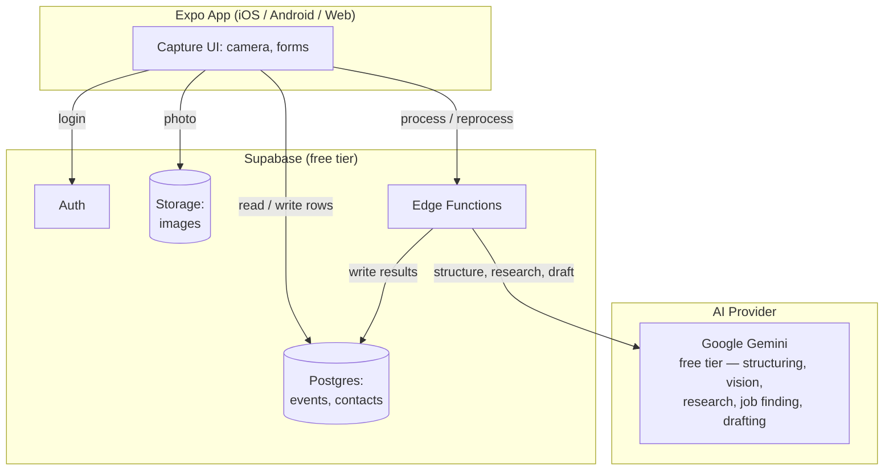

# BoothBuddy

A career fair / networking follow-up assistant. Capture typed notes and a
photo after each conversation, and let AI turn it into a structured contact
card and draft LinkedIn follow-up messages that night.

> 🚧 Status: early development (Phase 3 — AI pipeline). See
> [Roadmap](#roadmap) below for what's built vs. planned.

## The problem

At career fairs and networking events you talk to a lot of people quickly.
Afterward it's hard to remember who said what, who to follow up with first,
and what to actually say. BoothBuddy makes capture fast (typed notes + photo,
one-handed) and pushes the writing work — drafting personalized follow-up
messages — onto AI, done later that night when you have time to review.

## Screenshots

_Coming soon — screenshots will be added once the core capture flow (Phase 1)
is working._

## Features

- [x] Create an "Event" (career fair / networking event) and group contacts under it
- [x] Capture a contact in ~60 seconds: typed notes + photo(s) + name
- [ ] AI-structured contact card: name, title, company, contact info, summary,
      topics, opportunities mentioned, action items, interest level
- [ ] Business card / badge photo reading (vision) to pre-fill fields
- [ ] Person & company research with source links and match confirmation
- [ ] Open jobs/internships found per company, with links and deadlines
- [ ] Timeline view of everyone met at an event
- [ ] AI-drafted LinkedIn connection note + longer follow-up message per contact,
      with tone options and regenerate
- [ ] Track follow-up status: Not sent / Sent / Replied
- [ ] Jobs-to-apply checklist per event, sorted by deadline
- [ ] Action items checklist per event
- [ ] Search contacts
- [ ] Web dashboard for the end-of-day recap

## Tech stack

| Layer            | Choice                                              |
| ---------------- | ---------------------------------------------------- |
| App              | [Expo](https://expo.dev) (React Native) + [Expo Router](https://docs.expo.dev/router/introduction/) + TypeScript — one codebase for iOS, Android, and web |
| Backend          | [Supabase](https://supabase.com) free tier — Postgres database, email auth, file storage (images) |
| Server-side AI   | Supabase Edge Functions — the app never talks to AI APIs directly, so the API key never lives on-device |
| AI               | Google Gemini API free tier (Flash models) — contact structuring, business card/photo reading, person & company research, job finding, and message drafting, all in one provider to keep the project at $0 |
| Capture          | `expo-camera` (photo + QR scanning) |

### Why this stack

- **Expo + Expo Router** gives one TypeScript codebase for iOS, Android, and
  web, with platform-specific files (e.g. `Component.web.tsx`) where the
  mobile (capture-focused) and web (review-focused) UIs genuinely differ.
- **Supabase** bundles Postgres + auth + file storage behind one client
  library, which is enough for this app's needs without standing up a
  separate backend server.
- **Edge Functions as an AI proxy** is the only safe way to call AI APIs from
  a mobile app: any key bundled into the app binary can be extracted, so all
  AI calls happen server-side, authenticated by the user's Supabase session.
- **Gemini free tier only** keeps the whole project at $0 to run — no paid
  APIs, no paid hosting tier. The tradeoff is low rate limits, handled with
  retry-with-backoff and one-contact-at-a-time processing in the Edge
  Functions.

## Architecture



## Project structure

```
src/
  app/           # Expo Router screens (file-based routing) — one file = one screen
  components/    # Shared UI components, with .web.tsx variants where platforms differ
  constants/     # Theme, config constants
  hooks/         # Shared React hooks
```

## Setup

### Prerequisites

- Node.js 18+ and npm
- [Expo Go](https://expo.dev/go) app on your phone (for quick testing), or
  Xcode / Android Studio for simulators
- A [Supabase](https://supabase.com) account (added in Phase 2)

### Install and run

```bash
git clone <this-repo-url>
cd boothbuddy
npm install
cp .env.example .env   # fill in real values once Supabase is set up (Phase 2)
npx expo start
```

Then press `i` for iOS simulator, `a` for Android emulator, `w` for web, or
scan the QR code with Expo Go on your phone.

### Environment variables

See [`.env.example`](./.env.example). Client-side keys (Supabase URL/anon
key) go in `.env`. The Gemini API key is never stored in the app — it lives
only as a Supabase Edge Function secret (`GEMINI_API_KEY`).

## Roadmap

Built in phases, each one runnable and testable before moving to the next:

- [x] **Phase 0** — Project scaffolding: Expo + TypeScript + Expo Router, git, GitHub repo
- [x] **Phase 1** — Local-only MVP: create event, capture contact (name, notes, photo/QR), timeline view. No AI yet.
- [x] **Phase 2** — Supabase: auth, database schema, file storage, syncing
- [ ] **Phase 3** — AI pipeline via Gemini Edge Functions: contact structuring, business card reading, person & company research, job finding
- [ ] **Phase 4** — End-of-Day recap: follow-up drafts (copy/regenerate/tone, "Open LinkedIn", sent status), jobs-to-apply and action-item checklists
- [ ] **Phase 5** — Web dashboard for the end-of-day recap
- [ ] **Phase 6** — Search (only extra kept in scope)
- [ ] **Phase 7** — Polish, deployment (web to Vercel/Netlify free tier, mobile via Expo Go/EAS)
